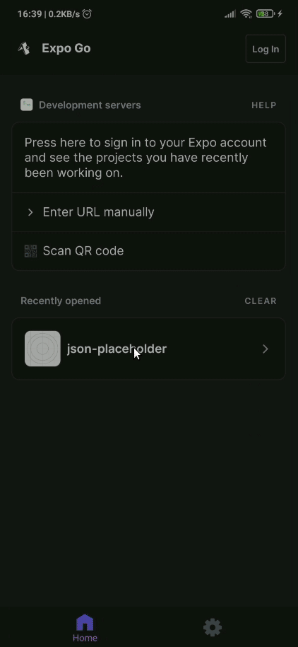

# React Native Example

This project was built with [**Expo**](https://expo.dev/) as an example for simple React Native app. Packages used in this projects:

- [React](https://reactjs.org/)
- [React Native](https://reactnative.dev/)
- [Expo](https://expo.dev/)
- [React Navigation](https://reactnavigation.org/)
- [Redux](https://redux.js.org/)
- [Redux Thunk](https://github.com/reduxjs/redux-thunk)
- [React Redux](https://react-redux.js.org/)
- [NativeBase](https://nativebase.io/)

To run this project, you can follow the steps below:

1. Install [**Expo CLI**](https://docs.expo.dev/workflow/expo-cli/) on your computer
1. Install [**Expo Go**](https://expo.dev/client) in your phone
1. Install all the dependencies using `npm install`
1. Run the project with `expo start`
1. Scan the QR code using **Expo Go** on your phone

